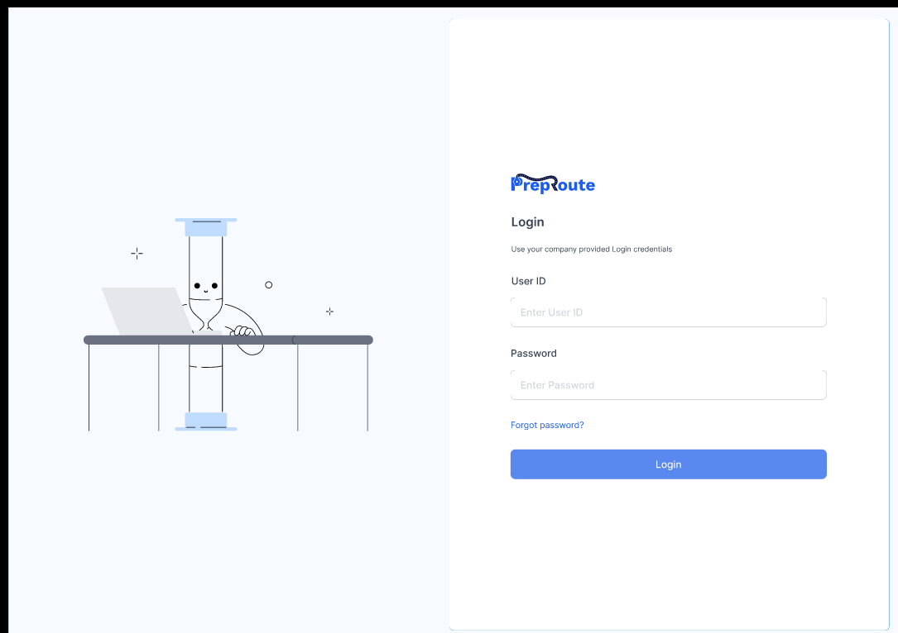
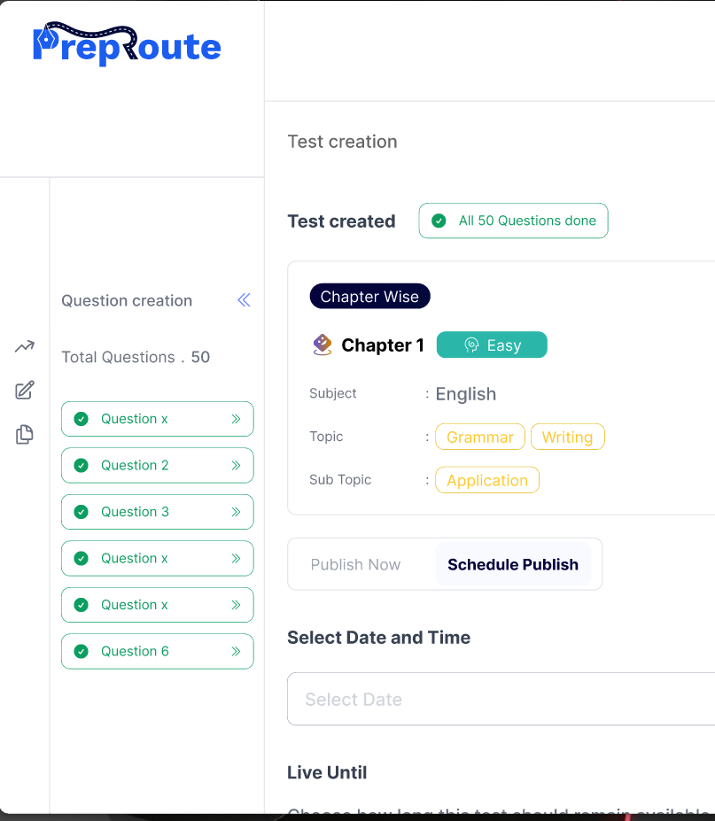
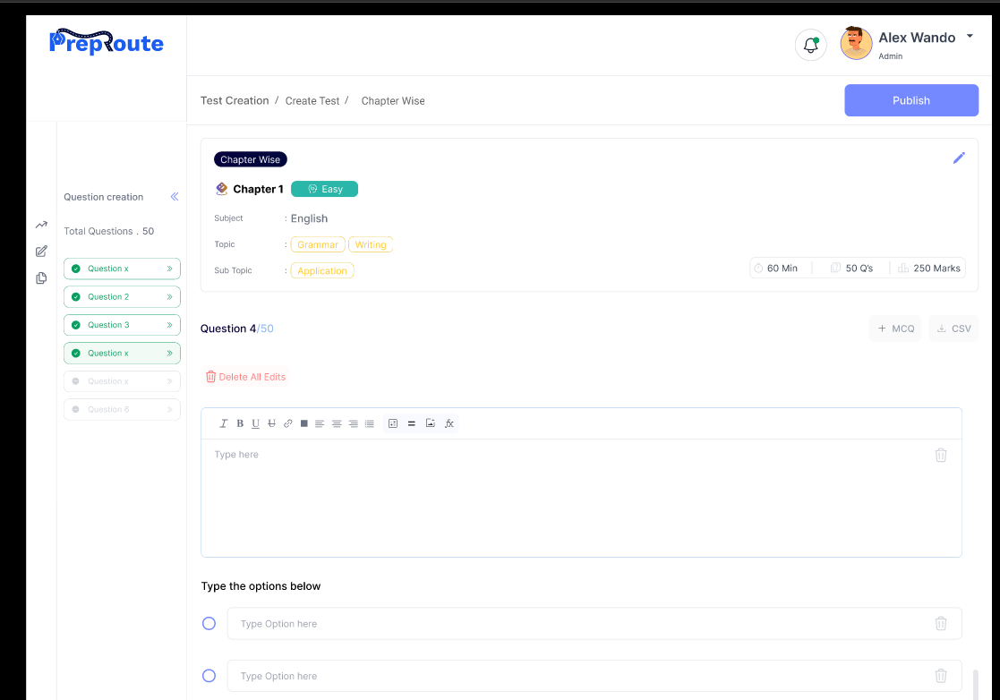
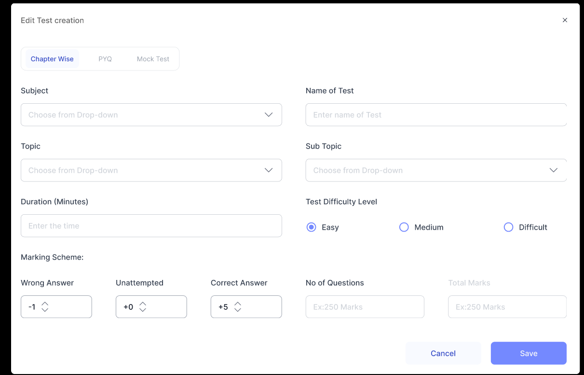

Always use :-
 -frontend-design, typescript-expert, web-design-guidelines these 3 skills for this project.
 -use " https://www.figma.com/design/Xe45bF7fnHroM1g1gDGXFR/Preproute-Assignment?node-id=0-1&t=YcqE8kZxcuERQ4IZ-1" for flow and UI design.
 -use Frontend-Developer-Task-Preproute.md for API connection.

 use this for pages design: 

 login page link : https://www.figma.com/proto/Xe45bF7fnHroM1g1gDGXFR/Preproute-Assignment?node-id=1-5202&t=0IfLcJHiWJ3pYeod-1&scaling=min-zoom&content-scaling=fixed&page-id=0%3A1 

 test created page link : https://www.figma.com/proto/Xe45bF7fnHroM1g1gDGXFR/Preproute-Assignment?node-id=1-5465&t=e43tNdcbFt9JDE1N-1&scaling=min-zoom&content-scaling=fixed&page-id=0%3A1 

 Test creation page link : https://www.figma.com/proto/Xe45bF7fnHroM1g1gDGXFR/Preproute-Assignment?node-id=1-5098&t=dkMtBvvEPZDiXyWX-1&scaling=contain&content-scaling=fixed&page-id=0%3A1 

 Test creation link :  